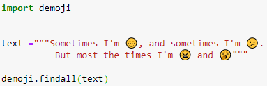
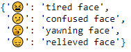

# Convert Emoji into Text in Python 🐍😀

This project demonstrates how to convert emojis into readable text using Python and the `demoji` module. Emojis are replaced with their textual descriptions, which is useful for text preprocessing, chat analysis, and NLP tasks.

---

## 🔧 Technologies Used
- Python 3.x
- demoji library

---

## 📦 About demoji Module

The demoji module is used to detect, remove, and replace emojis in text strings.
It requires an initial download of emoji data from the Unicode Consortium because emojis are frequently updated.

This is handled automatically in the code using:
demoji.download_codes()

---

## 🧪 Use Cases
- Text preprocessing for NLP.
- Chat and social media data analysis.
- Removing emojis for clean datasets.
- Converting emojis to readable descriptions.

---

## 🖼 Screenshot

---

## 📌 Notes
- Run demoji.download_codes() only once if internet access is available.
- Ensure Python 3.6 or higher is installed.
